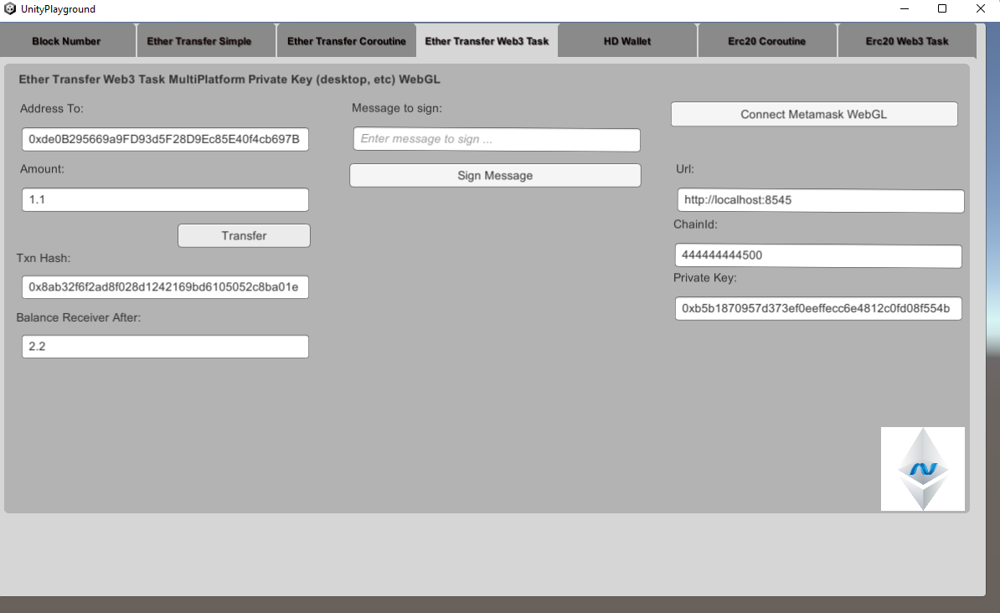
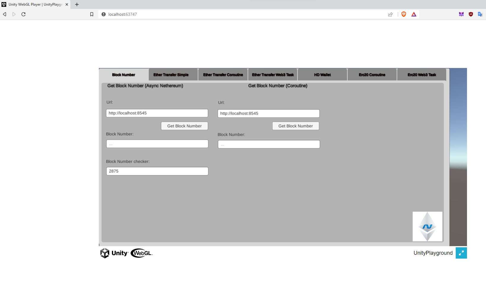

# Unity3d Simple Sample Net472

Simple sample for Unity3d development using Net472 (upgraded now from Net461), it includes all the DLLs in the asset folder.

Note: You may not need some of them so you can remove them (like Besu, Geth, HdWallet, NBitcoin, etc), depending on your needs.

The Unity Version used is 2020.3.15f LTS

Dlls: Nethereum, dependencies (BouncyCastle..) and System.Numerics.

The code just demonstrates:

* Output to the log the current BlockNumber using Unity.UI both in Async and coroutines
* Ether transfer using Unity.UI and coroutines
* Using 1559 Suggestion strategies or Legacy mode when tranfering Ether
* Smart contract deployment (ERC20), Transactions (Transfer) and Querying (Balance)

**Note:** 
* WebGl only supports coroutines UnityWebRequest. To build WebGl if having issues, uncheck Development Build.
* To support WebGl and AOT this sample uses the Net472AOT dlls with the custom Json.Net Unity 
* Please remember to remove System.HttpClient and UnityEngine of the Nethereum release package if included





To run a local blockchain you can just use the preconfigured [testchains](https://github.com/Nethereum/Nethereum.Workbooks/tree/master/testchain/)

### BlockNumber query Async (vanilla Nethereum)
```csharp
using System;
using System.Collections;
using System.Collections.Generic;
using System.Net;
using System.Net.Security;
using System.Security.Cryptography.X509Certificates;
using Nethereum.ABI.FunctionEncoding.Attributes;
using UnityEngine;
using UnityEngine.UI;
using Nethereum.Contracts;
using Nethereum.Web3;


public class GetLatestBlockVanillaNethereum : MonoBehaviour {

    private static bool TrustCertificate(object sender, X509Certificate x509Certificate, X509Chain x509Chain, SslPolicyErrors sslPolicyErrors)
    {
        // all certificates are accepted
        return true;
    }

    public string Url = "https://mainnet.infura.io";
   
    public InputField ResultBlockNumber;
    public InputField InputUrl;

    // Use this for initialization
    void Start()
    {
        InputUrl.text = Url;
    }

    public async void GetBlockNumber()
	{
        Url = InputUrl.text;
        //This is to workaround issue with certificates https://forum.unity.com/threads/how-to-allow-self-signed-certificate.522183/
        //Uncomment if needed
        // ServicePointManager.ServerCertificateValidationCallback = TrustCertificate;
        var web3 = new Web3(Url);
        
        var blockNumber = await web3.Eth.Blocks.GetBlockNumber.SendRequestAsync();
        ResultBlockNumber.text = blockNumber.Value.ToString();
    }
}
```
### BlockNumber query Coroutines
```csharp
using System.Collections;
using System.Collections.Generic;
using UnityEngine;
using UnityEngine.UI;
using Nethereum.JsonRpc.UnityClient;
using Nethereum.RPC.Eth.DTOs;
using Nethereum.Util;

public class GetLatestBlockCoroutine : MonoBehaviour
{
    public string Url = "https://mainnet.infura.io";

    public InputField ResultBlockNumber;
    public InputField InputUrl;

    // Use this for initialization
    void Start()
    {
        InputUrl.text = Url;
    }

    public void GetBlockNumberRequest()
    {
        StartCoroutine(GetBlockNumber());
    }

    public IEnumerator GetBlockNumber()
    {
        Url = InputUrl.text;

        var blockNumberRequest = new EthBlockNumberUnityRequest(Url);

        yield return blockNumberRequest.SendRequest();

        ResultBlockNumber.text = blockNumberRequest.Result.Value.ToString();
    }
}

```
## Simple Ether transfer
To transfer Ether Nethereum provides a specific Unity Request, the ```EthTransferUnityRequest```.

The EthTransferUnityRequest it is instantiated with the "url" of our Ethereum client, the private key to be able to sign transactions and our account address (the same of the private key).

```csharp
var url = "http://localhost:8545";
var privateKey = "0xb5b1870957d373ef0eeffecc6e4812c0fd08f554b37b233526acc331bf1544f7"; 
var ethTransfer = new EthTransferUnityRequest(url, privateKey, "YOURCHAINID");
```

Once our unity request is instantiated it we can initiate the transfer as follows using Legacy Mode providing 2 Gwei as the gas price

```csharp
var receivingAddress = "0xde0B295669a9FD93d5F28D9Ec85E40f4cb697BAe";
yield return ethTransfer.TransferEther(receivingAddress, 1.1m, 2);
```

Here we have specified the receivingAddress, the amount to send and the optional gas price in Gwei. The request will automatically convert the gas price to Wei.

We can validate afterwards if we have had any exception as following:
```
if (ethTransfer.Exception != null)
{
    Debug.Log(ethTransfer.Exception.Message);
    yield break;
}
```

If no errors have occurred we can retrieve the transaction hash from the Request and Poll every 2 seconds to wait for the transaction to be mined.

```csharp
 var transactionHash = ethTransfer.Result;
//create a poll to get the receipt when mined
var transactionReceiptPolling = new TransactionReceiptPollingRequest(url);
//checking every 2 seconds for the receipt
yield return transactionReceiptPolling.PollForReceipt(transactionHash, 2);
```

Finally we can check the balance of our recieving account, using ```EthGetBalanceUnityRequest```. Note that we specify we want the balance for the latest Block when doing the request.

```csharp
var balanceRequest = new EthGetBalanceUnityRequest(url);
yield return balanceRequest.SendRequest(receivingAddress, BlockParameter.CreateLatest());
```

We can convert the result in Wei to Eth using the default Wei UnitConvertor.

```csharp
Debug.Log("Balance of account:" + UnitConversion.Convert.FromWei(balanceRequest.Result.Value));
```
## EIP 1559 Fee suggestion using the strategies provided and Legacy Mode 
Here are some examples of using the provided fee suggestion strategies using coroutines, TimePreference, MedianFeeHistory or LegacyMode to use the old mode or to use with other chains.

To use LegacyMode you have to provide the GasPrice or it can be force the LegacyMode by setting ```UseLegacyAsDefault``` to true.

```csharp
       if (feeStrategy == FeeStrategy.TimePreference)
        {
            Debug.Log("Time Preference");
            var timePreferenceFeeSuggestion = new TimePreferenceFeeSuggestionUnityRequestStrategy(Url);

            yield return timePreferenceFeeSuggestion.SuggestFees();

            if (timePreferenceFeeSuggestion.Exception != null)
            {
                Debug.Log(timePreferenceFeeSuggestion.Exception.Message);
                yield break;
            }

            //lets get the first one so it is higher priority
            Debug.Log(timePreferenceFeeSuggestion.Result.Length);
            if (timePreferenceFeeSuggestion.Result.Length > 0)
            {
                Debug.Log(timePreferenceFeeSuggestion.Result[0].MaxFeePerGas);
                Debug.Log(timePreferenceFeeSuggestion.Result[0].MaxPriorityFeePerGas);
            }
            var fee = timePreferenceFeeSuggestion.Result[0];

            yield return ethTransfer.TransferEther(receivingAddress, Amount, fee.MaxPriorityFeePerGas.Value, fee.MaxFeePerGas.Value);
            if (ethTransfer.Exception != null)
            {
                Debug.Log(ethTransfer.Exception.Message);
                yield break;
            }
        }


        if(feeStrategy == FeeStrategy.MedianFeeHistory)
        {
            Debug.Log("MedianFeeHistory mode");
            var medianPriorityFeeStrategy = new MedianPriorityFeeHistorySuggestionUnityRequestStrategy(Url);

            yield return medianPriorityFeeStrategy.SuggestFee();

            if (medianPriorityFeeStrategy.Exception != null)
            {
                Debug.Log(medianPriorityFeeStrategy.Exception.Message);
                yield break;
            }
            
            Debug.Log(medianPriorityFeeStrategy.Result.MaxFeePerGas);
            Debug.Log(medianPriorityFeeStrategy.Result.MaxPriorityFeePerGas);
            
            var fee = medianPriorityFeeStrategy.Result;

            yield return ethTransfer.TransferEther(receivingAddress, Amount, fee.MaxPriorityFeePerGas.Value, fee.MaxFeePerGas.Value);
            if (ethTransfer.Exception != null)
            {
                Debug.Log(ethTransfer.Exception.Message);
                yield break;
            }
        }

        if (feeStrategy == FeeStrategy.Legacy)
        {
            Debug.Log("Legacy mode");
            //I am forcing the legacy mode but also I am including the gas price
            ethTransfer.UseLegacyAsDefault = true;

            yield return ethTransfer.TransferEther(receivingAddress, Amount, GasPriceGwei);

            if (ethTransfer.Exception != null)
            {
                Debug.Log(ethTransfer.Exception.Message);
                yield break;
            }

        }

```

### Full sample
```csharp
using System;
using System.Collections;
using System.Collections.Generic;
using System.Numerics;
using System.Runtime.InteropServices;
using Nethereum.ABI.FunctionEncoding.Attributes;
using Nethereum.ABI.Model;
using Nethereum.Contracts;
using Nethereum.Contracts.CQS;
using Nethereum.Contracts.Extensions;
using Nethereum.Hex.HexConvertors.Extensions;
using Nethereum.Hex.HexTypes;
using Nethereum.JsonRpc.UnityClient;
using Nethereum.RPC.Eth.DTOs;
using Nethereum.RPC.TransactionManagers;
using Nethereum.Signer;
using Nethereum.Util;
using Nethereum.Web3.Accounts;
using UnityEngine;
using UnityEngine.UI;

public class EtherTransferCoroutinesUnityWebRequest : MonoBehaviour {

    public string Url = "http://localhost:8545";
    public string PrivateKey = "0xb5b1870957d373ef0eeffecc6e4812c0fd08f554b37b233526acc331bf1544f7";
    public string AddressTo = "0xde0B295669a9FD93d5F28D9Ec85E40f4cb697BAe";
    public decimal Amount = 1.1m;
    public decimal GasPriceGwei = 2;
    public string TransactionHash = "";
    public decimal BalanceAddressTo = 0m;

    public InputField InputUrl;
    public InputField InputPrivateKey;
    public InputField InputAddressTo;
    public InputField InputAmount;

    public InputField ResultBalanceAddressTo;
    public InputField ResultTxnHash;

    // Use this for initialization
    void Start () {

        InputUrl.text = Url;
        InputPrivateKey.text = PrivateKey;
        InputAddressTo.text = AddressTo;
        InputAmount.text = Amount.ToString();

    }

    public void TransferRequest()
    {
        StartCoroutine(TransferEther());
    }

    public enum FeeStrategy
    {
        Legacy,
        TimePreference,
        MedianFeeHistory
    }

    //Sample of new features / requests
    public IEnumerator TransferEther()
    {
        Url = InputUrl.text;
        PrivateKey = InputPrivateKey.text;
        AddressTo = InputAddressTo.text;
        Amount = System.Decimal.Parse(InputAmount.text);

        //initialising the transaction request sender
        var ethTransfer = new EthTransferUnityRequest(Url, PrivateKey, 444444444500);

        var receivingAddress = AddressTo;

        var feeStrategy = FeeStrategy.Legacy;

        if (feeStrategy == FeeStrategy.TimePreference)
        {
            Debug.Log("Time Preference");
            var timePreferenceFeeSuggestion = new TimePreferenceFeeSuggestionUnityRequestStrategy(Url);

            yield return timePreferenceFeeSuggestion.SuggestFees();

            if (timePreferenceFeeSuggestion.Exception != null)
            {
                Debug.Log(timePreferenceFeeSuggestion.Exception.Message);
                yield break;
            }

            //lets get the first one so it is higher priority
            Debug.Log(timePreferenceFeeSuggestion.Result.Length);
            if (timePreferenceFeeSuggestion.Result.Length > 0)
            {
                Debug.Log(timePreferenceFeeSuggestion.Result[0].MaxFeePerGas);
                Debug.Log(timePreferenceFeeSuggestion.Result[0].MaxPriorityFeePerGas);
            }
            var fee = timePreferenceFeeSuggestion.Result[0];

            yield return ethTransfer.TransferEther(receivingAddress, Amount, fee.MaxPriorityFeePerGas.Value, fee.MaxFeePerGas.Value);
            if (ethTransfer.Exception != null)
            {
                Debug.Log(ethTransfer.Exception.Message);
                yield break;
            }
        }


        if(feeStrategy == FeeStrategy.MedianFeeHistory)
        {
            Debug.Log("MedianFeeHistory mode");
            var medianPriorityFeeStrategy = new MedianPriorityFeeHistorySuggestionUnityRequestStrategy(Url);

            yield return medianPriorityFeeStrategy.SuggestFee();

            if (medianPriorityFeeStrategy.Exception != null)
            {
                Debug.Log(medianPriorityFeeStrategy.Exception.Message);
                yield break;
            }
            
            Debug.Log(medianPriorityFeeStrategy.Result.MaxFeePerGas);
            Debug.Log(medianPriorityFeeStrategy.Result.MaxPriorityFeePerGas);
            
            var fee = medianPriorityFeeStrategy.Result;

            yield return ethTransfer.TransferEther(receivingAddress, Amount, fee.MaxPriorityFeePerGas.Value, fee.MaxFeePerGas.Value);
            if (ethTransfer.Exception != null)
            {
                Debug.Log(ethTransfer.Exception.Message);
                yield break;
            }
        }

        if (feeStrategy == FeeStrategy.Legacy)
        {
            Debug.Log("Legacy mode");
            //I am forcing the legacy mode but also I am including the gas price
            ethTransfer.UseLegacyAsDefault = true;

            yield return ethTransfer.TransferEther(receivingAddress, Amount, GasPriceGwei);

            if (ethTransfer.Exception != null)
            {
                Debug.Log(ethTransfer.Exception.Message);
                yield break;
            }

        }

        TransactionHash = ethTransfer.Result;
        ResultTxnHash.text = TransactionHash;
        Debug.Log("Transfer transaction hash:" + TransactionHash);

        //create a poll to get the receipt when mined
        var transactionReceiptPolling = new TransactionReceiptPollingRequest(Url);
        //checking every 2 seconds for the receipt
        yield return transactionReceiptPolling.PollForReceipt(TransactionHash, 2);
        
        Debug.Log("Transaction mined");

        var balanceRequest = new EthGetBalanceUnityRequest(Url);
        yield return balanceRequest.SendRequest(receivingAddress, BlockParameter.CreateLatest());

        BalanceAddressTo = UnitConversion.Convert.FromWei(balanceRequest.Result.Value);
        ResultBalanceAddressTo.text = BalanceAddressTo.ToString();

        Debug.Log("Balance of account:" + BalanceAddressTo);
    }


    // Update is called once per frame
    void Update () {
		
	}

}
```

# Smart contract Integration

This sample covers all the steps of smart contract integration using the ERC20 standard token.

## Declare our smart contract definition
First step is to include our smart contract definition, this can be code generated using the vscode solidity extension or the console code generation tool.

```csharp
//Deployment contract object definition
    public partial class EIP20Deployment : EIP20DeploymentBase
    {
        public EIP20Deployment() : base(BYTECODE) { }
        public EIP20Deployment(string byteCode) : base(byteCode) { }
    }


    public class EIP20DeploymentBase : ContractDeploymentMessage
    {
        public static string BYTECODE = "608060405234801561001057600080fd5b506040516107843803806107848339810160409081528151602080840151838501516060860151336000908152808552959095208490556002849055908501805193959094919391019161006991600391860190610096565b506004805460ff191660ff8416179055805161008c906005906020840190610096565b5050505050610131565b828054600181600116156101000203166002900490600052602060002090601f016020900481019282601f106100d757805160ff1916838001178555610104565b82800160010185558215610104579182015b828111156101045782518255916020019190600101906100e9565b50610110929150610114565b5090565b61012e91905b80821115610110576000815560010161011a565b90565b610644806101406000396000f3006080604052600436106100ae5763ffffffff7c010000000000000000000000000000000000000000000000000000000060003504166306fdde0381146100b3578063095ea7b31461013d57806318160ddd1461017557806323b872dd1461019c57806327e235e3146101c6578063313ce567146101e75780635c6581651461021257806370a082311461023957806395d89b411461025a578063a9059cbb1461026f578063dd62ed3e14610293575b600080fd5b3480156100bf57600080fd5b506100c86102ba565b6040805160208082528351818301528351919283929083019185019080838360005b838110156101025781810151838201526020016100ea565b50505050905090810190601f16801561012f5780820380516001836020036101000a031916815260200191505b509250505060405180910390f35b34801561014957600080fd5b50610161600160a060020a0360043516602435610348565b604080519115158252519081900360200190f35b34801561018157600080fd5b5061018a6103ae565b60408051918252519081900360200190f35b3480156101a857600080fd5b50610161600160a060020a03600435811690602435166044356103b4565b3480156101d257600080fd5b5061018a600160a060020a03600435166104b7565b3480156101f357600080fd5b506101fc6104c9565b6040805160ff9092168252519081900360200190f35b34801561021e57600080fd5b5061018a600160a060020a03600435811690602435166104d2565b34801561024557600080fd5b5061018a600160a060020a03600435166104ef565b34801561026657600080fd5b506100c861050a565b34801561027b57600080fd5b50610161600160a060020a0360043516602435610565565b34801561029f57600080fd5b5061018a600160a060020a03600435811690602435166105ed565b6003805460408051602060026001851615610100026000190190941693909304601f810184900484028201840190925281815292918301828280156103405780601f1061031557610100808354040283529160200191610340565b820191906000526020600020905b81548152906001019060200180831161032357829003601f168201915b505050505081565b336000818152600160209081526040808320600160a060020a038716808552908352818420869055815186815291519394909390927f8c5be1e5ebec7d5bd14f71427d1e84f3dd0314c0f7b2291e5b200ac8c7c3b925928290030190a350600192915050565b60025481565b600160a060020a03831660008181526001602090815260408083203384528252808320549383529082905281205490919083118015906103f45750828110155b15156103ff57600080fd5b600160a060020a038085166000908152602081905260408082208054870190559187168152208054849003905560001981101561046157600160a060020a03851660009081526001602090815260408083203384529091529020805484900390555b83600160a060020a031685600160a060020a03167fddf252ad1be2c89b69c2b068fc378daa952ba7f163c4a11628f55a4df523b3ef856040518082815260200191505060405180910390a3506001949350505050565b60006020819052908152604090205481565b60045460ff1681565b600160209081526000928352604080842090915290825290205481565b600160a060020a031660009081526020819052604090205490565b6005805460408051602060026001851615610100026000190190941693909304601f810184900484028201840190925281815292918301828280156103405780601f1061031557610100808354040283529160200191610340565b3360009081526020819052604081205482111561058157600080fd5b3360008181526020818152604080832080548790039055600160a060020a03871680845292819020805487019055805186815290519293927fddf252ad1be2c89b69c2b068fc378daa952ba7f163c4a11628f55a4df523b3ef929181900390910190a350600192915050565b600160a060020a039182166000908152600160209081526040808320939094168252919091522054905600a165627a7a7230582084c618322109054a21a57e27075384a6172ab854e4b2c2d35062a964a6bf593f0029";

        public EIP20DeploymentBase() : base(BYTECODE) { }

        public EIP20DeploymentBase(string byteCode) : base(byteCode) { }

        [Parameter("uint256", "_initialAmount", 1)]

        public BigInteger InitialAmount { get; set; }

        [Parameter("string", "_tokenName", 2)]

        public string TokenName { get; set; }

        [Parameter("uint8", "_decimalUnits", 3)]

        public byte DecimalUnits { get; set; }

        [Parameter("string", "_tokenSymbol", 4)]

        public string TokenSymbol { get; set; }

    }


    [Function("transfer", "bool")]
    public class TransferFunctionBase : FunctionMessage
    {
        [Parameter("address", "_to", 1)]
        public string To { get; set; }
        [Parameter("uint256", "_value", 2)]
        public BigInteger Value { get; set; }
    }


    public partial class TransferFunction : TransferFunctionBase
    {
    }

    [Function("balanceOf", "uint256")]
    public class BalanceOfFunction : FunctionMessage
    {
        [Parameter("address", "_owner", 1)]
        public string Owner { get; set; }
    }

    [FunctionOutput]
    public class BalanceOfFunctionOutput : IFunctionOutputDTO
    {
        [Parameter("uint256", 1)]
        public int Balance { get; set; }
    }
    
    [Event("Transfer")]
    public class TransferEventDTOBase : IEventDTO
    {
        [Parameter("address", "_from", 1, true)]
        public virtual string From { get; set; }

        [Parameter("address", "_to", 2, true)]
        public virtual string To { get; set; }

        [Parameter("uint256", "_value", 3, false)]
        public virtual BigInteger Value { get; set; }
    }

    public partial class TransferEventDTO : TransferEventDTOBase
    {
        public static EventABI GetEventABI()
        {
            return EventExtensions.GetEventABI<TransferEventDTO>();
        }
    }
```

## Contract deployment
To deploy a smart contract we create a TransactionSignedUnityRequest with our url and signing information.
Creating a new EIP20Deployment contract definition we set the constructor parameters and send the transaction.
Finally we we create TransactionReceiptPollingRequest to poll for the transaction receipt and retrieve the newly deployed contract address from the transaction receipt.

```csharp
        var url = "http://localhost:8545";
        var privateKey = "0xb5b1870957d373ef0eeffecc6e4812c0fd08f554b37b233526acc331bf1544f7";
        var account = "0x12890d2cce102216644c59daE5baed380d84830c";
        //initialising the transaction request sender
        
        var transactionRequest = new TransactionSignedUnityRequest(url, privateKey, "YOURCHAINID");

        var deployContract = new EIP20Deployment()
        {
            InitialAmount = 10000,
            FromAddress = account,
            TokenName = "TST",
            TokenSymbol = "TST"
        };

        //deploy the contract
        yield return transactionRequest.SignAndSendDeploymentContractTransaction<EIP20DeploymentBase>(deployContract);

        if (transactionRequest.Exception != null)
        {
            Debug.Log(transactionRequest.Exception.Message);
            yield break;
        }

        var transactionHash = transactionRequest.Result;
        Debug.Log("Deployment transaction hash:" + transactionHash);

        //create a poll to get the receipt when mined
        var transactionReceiptPolling = new TransactionReceiptPollingRequest(url);

        //checking every 2 seconds for the receipt
        yield return transactionReceiptPolling.PollForReceipt(transactionHash, 2);

        var deploymentReceipt = transactionReceiptPolling.Result;

        Debug.Log("Deployment contract address:" + deploymentReceipt.ContractAddress);
```

## Query smart contract
To Query a smart contract we need to create a new QueryUnityRequest providing the FunctionType and ReturnType.
We then will yield the Query and the query result Result object will provide us the Ouput of the contract already decoded.

```csharp
 //Query request using our acccount and the contracts address (no parameters needed and default values)
        var queryRequest = new QueryUnityRequest<BalanceOfFunction, BalanceOfFunctionOutput>(url, account);
        yield return queryRequest.Query(new BalanceOfFunction(){Owner = account}, deploymentReceipt.ContractAddress);

        //Getting the dto response already decoded
        var dtoResult = queryRequest.Result;
        Debug.Log(dtoResult.Balance);
```

## Transfer transaction
To send a transaction to interact with a smart contract has similar steps to the deployment.
We first create a TransactionSignedUnityRequest and our Function including any parameters, once the transaction is send we poll for the transaction receipt which will confirm the success of the transaction.

Using the transaction receipt we can decoded any logs / events for that transaction.

```csharp
 var transactionTransferRequest = new TransactionSignedUnityRequest(url, privateKey, "YOURCHAINID");
        var newAddress = "0xde0B295669a9FD93d5F28D9Ec85E40f4cb697BAe";


        var transactionMessage = new TransferFunction
        {
            FromAddress = account,
            To = newAddress,
            Value = 1000,
        };

        yield return transactionTransferRequest.SignAndSendTransaction(transactionMessage, deploymentReceipt.ContractAddress);
        var transactionTransferHash = transactionTransferRequest.Result;

        Debug.Log("Transfer txn hash:" + transactionHash);

        transactionReceiptPolling = new TransactionReceiptPollingRequest(url);
        yield return transactionReceiptPolling.PollForReceipt(transactionTransferHash, 2);
        var transferReceipt = transactionReceiptPolling.Result;

        var transferEvent = transferReceipt.DecodeAllEvents<TransferEventDTO>();
        Debug.Log("Transferd amount from event: " + transferEvent[0].Event.Value);
```

## Logs and Events
To retrived the logs / events of a smart contract we use the EthGetLogsUnityRequest combined with a FilterInput specific to our Event.
FilterInputs can be created using the EventDTO extension GetEventABI().
Once we have yield the request, we can decode all matching events using the Result.DecodeAllEvents<TransferEventDTO>, extension method.

```csharp
        var getLogsRequest = new EthGetLogsUnityRequest(url);
        var eventTransfer = TransferEventDTO.GetEventABI();
        yield return getLogsRequest.SendRequest(eventTransfer.CreateFilterInput(deploymentReceipt.ContractAddress, account));
        var eventDecoded = getLogsRequest.Result.DecodeAllEvents<TransferEventDTO>();
        Debug.Log("Transferd amount from get logs event: " + eventDecoded[0].Event.Value);
```

## Full sample
```csharp
using System.Collections;
using System.Collections.Generic;
using System.Numerics;
using Nethereum.ABI.FunctionEncoding.Attributes;
using Nethereum.ABI.Model;
using Nethereum.Contracts;
using Nethereum.Contracts.CQS;
using Nethereum.Contracts.Extensions;
using Nethereum.JsonRpc.UnityClient;
using UnityEngine;

public class TokenDeployAndSendCoroutinesUnityWebRequest : MonoBehaviour {

    //Deployment contract object definition

    public partial class EIP20Deployment : EIP20DeploymentBase
    {
        public EIP20Deployment() : base(BYTECODE) { }

        public EIP20Deployment(string byteCode) : base(byteCode) { }
    }

    public class EIP20DeploymentBase : ContractDeploymentMessage
    {

        public static string BYTECODE = "608060405234801561001057600080fd5b506040516107843803806107848339810160409081528151602080840151838501516060860151336000908152808552959095208490556002849055908501805193959094919391019161006991600391860190610096565b506004805460ff191660ff8416179055805161008c906005906020840190610096565b5050505050610131565b828054600181600116156101000203166002900490600052602060002090601f016020900481019282601f106100d757805160ff1916838001178555610104565b82800160010185558215610104579182015b828111156101045782518255916020019190600101906100e9565b50610110929150610114565b5090565b61012e91905b80821115610110576000815560010161011a565b90565b610644806101406000396000f3006080604052600436106100ae5763ffffffff7c010000000000000000000000000000000000000000000000000000000060003504166306fdde0381146100b3578063095ea7b31461013d57806318160ddd1461017557806323b872dd1461019c57806327e235e3146101c6578063313ce567146101e75780635c6581651461021257806370a082311461023957806395d89b411461025a578063a9059cbb1461026f578063dd62ed3e14610293575b600080fd5b3480156100bf57600080fd5b506100c86102ba565b6040805160208082528351818301528351919283929083019185019080838360005b838110156101025781810151838201526020016100ea565b50505050905090810190601f16801561012f5780820380516001836020036101000a031916815260200191505b509250505060405180910390f35b34801561014957600080fd5b50610161600160a060020a0360043516602435610348565b604080519115158252519081900360200190f35b34801561018157600080fd5b5061018a6103ae565b60408051918252519081900360200190f35b3480156101a857600080fd5b50610161600160a060020a03600435811690602435166044356103b4565b3480156101d257600080fd5b5061018a600160a060020a03600435166104b7565b3480156101f357600080fd5b506101fc6104c9565b6040805160ff9092168252519081900360200190f35b34801561021e57600080fd5b5061018a600160a060020a03600435811690602435166104d2565b34801561024557600080fd5b5061018a600160a060020a03600435166104ef565b34801561026657600080fd5b506100c861050a565b34801561027b57600080fd5b50610161600160a060020a0360043516602435610565565b34801561029f57600080fd5b5061018a600160a060020a03600435811690602435166105ed565b6003805460408051602060026001851615610100026000190190941693909304601f810184900484028201840190925281815292918301828280156103405780601f1061031557610100808354040283529160200191610340565b820191906000526020600020905b81548152906001019060200180831161032357829003601f168201915b505050505081565b336000818152600160209081526040808320600160a060020a038716808552908352818420869055815186815291519394909390927f8c5be1e5ebec7d5bd14f71427d1e84f3dd0314c0f7b2291e5b200ac8c7c3b925928290030190a350600192915050565b60025481565b600160a060020a03831660008181526001602090815260408083203384528252808320549383529082905281205490919083118015906103f45750828110155b15156103ff57600080fd5b600160a060020a038085166000908152602081905260408082208054870190559187168152208054849003905560001981101561046157600160a060020a03851660009081526001602090815260408083203384529091529020805484900390555b83600160a060020a031685600160a060020a03167fddf252ad1be2c89b69c2b068fc378daa952ba7f163c4a11628f55a4df523b3ef856040518082815260200191505060405180910390a3506001949350505050565b60006020819052908152604090205481565b60045460ff1681565b600160209081526000928352604080842090915290825290205481565b600160a060020a031660009081526020819052604090205490565b6005805460408051602060026001851615610100026000190190941693909304601f810184900484028201840190925281815292918301828280156103405780601f1061031557610100808354040283529160200191610340565b3360009081526020819052604081205482111561058157600080fd5b3360008181526020818152604080832080548790039055600160a060020a03871680845292819020805487019055805186815290519293927fddf252ad1be2c89b69c2b068fc378daa952ba7f163c4a11628f55a4df523b3ef929181900390910190a350600192915050565b600160a060020a039182166000908152600160209081526040808320939094168252919091522054905600a165627a7a7230582084c618322109054a21a57e27075384a6172ab854e4b2c2d35062a964a6bf593f0029";

        public EIP20DeploymentBase() : base(BYTECODE) { }

        public EIP20DeploymentBase(string byteCode) : base(byteCode) { }

        [Parameter("uint256", "_initialAmount", 1)]
        public BigInteger InitialAmount { get; set; }
        [Parameter("string", "_tokenName", 2)]
        public string TokenName { get; set; }
        [Parameter("uint8", "_decimalUnits", 3)]
        public byte DecimalUnits { get; set; }
        [Parameter("string", "_tokenSymbol", 4)]
        public string TokenSymbol { get; set; }

    }

    [Function("transfer", "bool")]
    public class TransferFunctionBase : FunctionMessage
    {
        [Parameter("address", "_to", 1)]
        public string To { get; set; }
        [Parameter("uint256", "_value", 2)]
        public BigInteger Value { get; set; }
    }

    public partial class TransferFunction : TransferFunctionBase
    {

    }

    [Function("balanceOf", "uint256")]
    public class BalanceOfFunction : FunctionMessage
    {
        [Parameter("address", "_owner", 1)]
        public string Owner { get; set; }
    }

    [FunctionOutput]
    public class BalanceOfFunctionOutput : IFunctionOutputDTO
    {
        [Parameter("uint256", 1)]
        public int Balance { get; set; }
    }

    [Event("Transfer")]
    public class TransferEventDTOBase : IEventDTO
    {

        [Parameter("address", "_from", 1, true)]
        public virtual string From { get; set; }
        [Parameter("address", "_to", 2, true)]
        public virtual string To { get; set; }
        [Parameter("uint256", "_value", 3, false)]
        public virtual BigInteger Value { get; set; }
    }

    public partial class TransferEventDTO : TransferEventDTOBase
    {
        public static EventABI GetEventABI()
        {
            return EventExtensions.GetEventABI<TransferEventDTO>();
        }
    }

    // Use this for initialization
    void Start () {

       StartCoroutine(DeployAndTransferToken());
    }


    //Sample of new features / requests
    public IEnumerator DeployAndTransferToken()
    {
        var url = "http://localhost:8545";
        var privateKey = "0xb5b1870957d373ef0eeffecc6e4812c0fd08f554b37b233526acc331bf1544f7";
        var account = "0x12890d2cce102216644c59daE5baed380d84830c";
        //initialising the transaction request sender
        var transactionRequest = new TransactionSignedUnityRequest(url, privateKey);


        var deployContract = new EIP20Deployment()
        {
            InitialAmount = 10000,
            FromAddress = account,
            TokenName = "TST",
            TokenSymbol = "TST"
        };

        //deploy the contract and True indicates we want to estimate the gas
        yield return transactionRequest.SignAndSendDeploymentContractTransaction<EIP20DeploymentBase>(deployContract);

        if (transactionRequest.Exception != null)
        {
            Debug.Log(transactionRequest.Exception.Message);
            yield break;
        }

        var transactionHash = transactionRequest.Result;

        Debug.Log("Deployment transaction hash:" + transactionHash);

        //create a poll to get the receipt when mined
        var transactionReceiptPolling = new TransactionReceiptPollingRequest(url);
        //checking every 2 seconds for the receipt
        yield return transactionReceiptPolling.PollForReceipt(transactionHash, 2);
        var deploymentReceipt = transactionReceiptPolling.Result;

        Debug.Log("Deployment contract address:" + deploymentReceipt.ContractAddress);

        //Query request using our acccount and the contracts address (no parameters needed and default values)
        var queryRequest = new QueryUnityRequest<BalanceOfFunction, BalanceOfFunctionOutput>(url, account);
        yield return queryRequest.Query(new BalanceOfFunction(){Owner = account}, deploymentReceipt.ContractAddress);

        //Getting the dto response already decoded
        var dtoResult = queryRequest.Result;
        Debug.Log(dtoResult.Balance);


        var transactionTransferRequest = new TransactionSignedUnityRequest(url, privateKey);

        var newAddress = "0xde0B295669a9FD93d5F28D9Ec85E40f4cb697BAe";

        var transactionMessage = new TransferFunction
        {
            FromAddress = account,
            To = newAddress,
            Value = 1000,

        };

        yield return transactionTransferRequest.SignAndSendTransaction(transactionMessage, deploymentReceipt.ContractAddress);

        var transactionTransferHash = transactionTransferRequest.Result;

        Debug.Log("Transfer txn hash:" + transactionHash);

        transactionReceiptPolling = new TransactionReceiptPollingRequest(url);
        yield return transactionReceiptPolling.PollForReceipt(transactionTransferHash, 2);
        var transferReceipt = transactionReceiptPolling.Result;

        var transferEvent = transferReceipt.DecodeAllEvents<TransferEventDTO>();
        Debug.Log("Transferd amount from event: " + transferEvent[0].Event.Value);

        var getLogsRequest = new EthGetLogsUnityRequest(url);

        var eventTransfer = TransferEventDTO.GetEventABI();
        yield return getLogsRequest.SendRequest(eventTransfer.CreateFilterInput(deploymentReceipt.ContractAddress, account));

        var eventDecoded = getLogsRequest.Result.DecodeAllEvents<TransferEventDTO>();

        Debug.Log("Transferd amount from get logs event: " + eventDecoded[0].Event.Value);
    }
  
}
```


