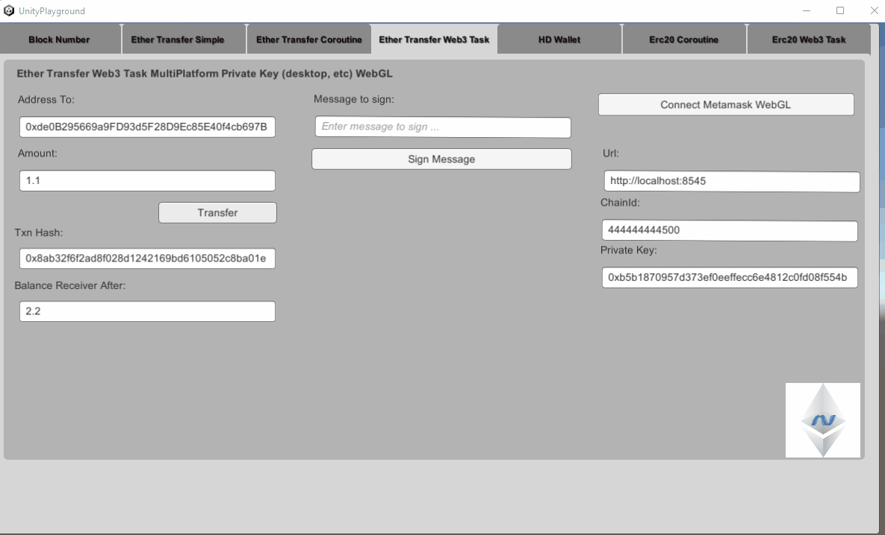

# Unity3d Sample Template Net472 / Netstandard

Sample template to get started Unity3d development using Nethereum. It includes the necessary dlls from the Net472AOT Common release in the asset folder (other none specialised ones like geth, reactive, etc are not included but can be downloaded from Nethereum releases if needed). Netstandard libraries work the same. Some libraries you might not need, like Nethereum.HD and NBitcoin to support Hierarchical Deterministic Wallets so you can remove them.

Unity Version used is 2022.1.23 

Dlls included: Nethereum, dependencies (BouncyCastle, Microsoft.Extensions.Logging.Abstractions, NBitcoin.dll for HD Wallet)

The code demonstrates:

* Output to the log the current BlockNumber using Unity.UI both in Async and coroutines
* Ether transfer using Unity.UI and coroutines
* Using 1559 Suggestion strategies or Legacy mode when tranfering Ether
* Smart contract deployment (ERC20), Transactions (Transfer) and Querying (Balance)
* Cross Platform architecture for both Coroutines and Task to enable the reuse of your code using different deployments Native /Desktop or Browser using Metamask)
* Metamask connectivity in browser

## Important Notes:
* All the examples are self contained, to simplify them, so when working with the browser you will need "Connect" per example.
* WebGL: When using Web3 with Tasks this requires something like the WebGLThreadingPatcher https://github.com/VolodymyrBS/WebGLThreadingPatcher, or any other way to enable wasm with Task threading support.
* To support AOT and WebGL this sample uses the Nethereum dlls packaged for Net472AOT or NetstandardAOT with the custom Newtonsoft Json.Net by Unity
* Please remember to remove System.HttpClient and UnityEngine of the Nethereum release package if included
* Nethereum.Unity.Metamask is only supported in WebGL at the moment, the Metamask SDK will be supported shortly, currently work in progresss (if you require access to small PoC let me know)

* If creating a custom index.html file, or rebuilding webgl in a new folder, the script needs to instantiate ```nethereumUnityInstance``` as per the example here: https://github.com/Nethereum/Unity3dSampleTemplate/blob/master/webgl/index.html#L107
* When building to Desktop and other platforms (not web), you will requited to use "https" instead of "http" as the newer versions of Unity validate this.

### Desktop demo



### Browser demo


### Test Chain
To run a local blockchain you can just use the preconfigured [testchains](https://github.com/Nethereum/Nethereum.Workbooks/tree/master/testchain/)
All the examples use the chainId "444444444500" as default, needless to say you can change it to your own.

### BlockNumber query Async (vanilla Nethereum)
```csharp
using System;
using System.Net.Security;
using System.Security.Cryptography.X509Certificates;
using UnityEngine;
using UnityEngine.UI;
using Nethereum.Web3;
using System.Threading.Tasks;
using Nethereum.Unity.Rpc;

public class GetLatestBlockVanillaNethereum : MonoBehaviour {

    private static bool TrustCertificate(object sender, X509Certificate x509Certificate, X509Chain x509Chain, SslPolicyErrors sslPolicyErrors)
    {
        // all certificates are accepted
        return true;
    }

    public string Url = "http://localhost:8545";
    public InputField ResultBlockNumber;
    public InputField ResultBlockNumberConstant;
    
    public InputField InputUrl;

    // Use this for initialization
    async void Start()
    {
        InputUrl.text = Url;
        await CheckBlockNumberPeriodically();
    }
    public async Task CheckBlockNumberPeriodically()
    {
        var wait = 1000;
        while (true)
        {
           await Task.Delay(wait);
           wait = 1000;
           var web3 = new Web3(new UnityWebRequestRpcTaskClient(new Uri(InputUrl.text)));
            
           var blockNumber = await web3.Eth.Blocks.GetBlockNumber.SendRequestAsync();
           ResultBlockNumberConstant.text = blockNumber.Value.ToString();
        }
    }

    public async void GetBlockNumber()
	{
        Url = InputUrl.text;
        //This is to workaround issue with certificates https://forum.unity.com/threads/how-to-allow-self-signed-certificate.522183/
        //Uncomment if needed
        //ServicePointManager.ServerCertificateValidationCallback = TrustCertificate;
        var web3 = new Web3(new UnityWebRequestRpcTaskClient(new Uri(InputUrl.text)));
        var blockNumber = await web3.Eth.Blocks.GetBlockNumber.SendRequestAsync();
        ResultBlockNumber.text = blockNumber.Value.ToString();
    }
}
```
### BlockNumber query Coroutines
```csharp
using System.Collections;
using UnityEngine;
using UnityEngine.UI;
using Nethereum.Unity.Rpc;

public class GetLatestBlockCoroutine : MonoBehaviour
{
    public string Url = "http://localhost:8545";

    public InputField ResultBlockNumber;
    public InputField InputUrl;

    // Use this for initialization
    void Start()
    {
        InputUrl.text = Url;
    }

    public void GetBlockNumberRequest()
    {
        Url = InputUrl.text;
        StartCoroutine(GetBlockNumber());
    }

    public IEnumerator GetBlockNumber()
    {

       var blockNumberRequest = new EthBlockNumberUnityRequest(InputUrl.text);
 
       yield return blockNumberRequest.SendRequest();

        if (blockNumberRequest.Exception != null)
        {
            UnityEngine.Debug.Log(blockNumberRequest.Exception.Message);
        }
        else
        {
            ResultBlockNumber.text = blockNumberRequest.Result.Value.ToString();
        }
        
    }
 }

```
## Simple Ether transfer using Coroutines 
To transfer Ether Nethereum provides a specific Unity Request, the ```EthTransferUnityRequest```.

The EthTransferUnityRequest it is instantiated with the "url" of our Ethereum client, the private key to be able to sign transactions and our account address (the same of the private key).

```csharp
var url = "http://localhost:8545";
var privateKey = "0xb5b1870957d373ef0eeffecc6e4812c0fd08f554b37b233526acc331bf1544f7"; 
var ethTransfer = new EthTransferUnityRequest(url, privateKey, "YOURCHAINID");
```

Once our unity request is instantiated it we can initiate the transfer as follows using Legacy Mode providing 2 Gwei as the gas price

```csharp
var receivingAddress = "0xde0B295669a9FD93d5F28D9Ec85E40f4cb697BAe";
yield return ethTransfer.TransferEther(receivingAddress, 1.1m, 2);
```

Here we have specified the receivingAddress, the amount to send and the optional gas price in Gwei. The request will automatically convert the gas price to Wei.

We can validate afterwards if we have had any exception as following:
```
if (ethTransfer.Exception != null)
{
    Debug.Log(ethTransfer.Exception.Message);
    yield break;
}
```

If no errors have occurred we can retrieve the transaction hash from the Request and Poll every 2 seconds to wait for the transaction to be mined.

```csharp
 var transactionHash = ethTransfer.Result;
//create a poll to get the receipt when mined
var transactionReceiptPolling = new TransactionReceiptPollingRequest(url);
//checking every 2 seconds for the receipt
yield return transactionReceiptPolling.PollForReceipt(transactionHash, 2);
```

Finally we can check the balance of our recieving account, using ```EthGetBalanceUnityRequest```. Note that we specify we want the balance for the latest Block when doing the request.

```csharp
var balanceRequest = new EthGetBalanceUnityRequest(url);
yield return balanceRequest.SendRequest(receivingAddress, BlockParameter.CreateLatest());
```

We can convert the result in Wei to Eth using the default Wei UnitConvertor.

```csharp
Debug.Log("Balance of account:" + UnitConversion.Convert.FromWei(balanceRequest.Result.Value));
```

## Transfer using Task / Web3

To transfer Ether using Web3 and Tasks we can use the same example as the Netherum playground http://playground.nethereum.com/csharp/id/1003

```csharp

var privateKey = "0x7580e7fb49df1c861f0050fae31c2224c6aba908e116b8da44ee8cd927b990b0";
var chainId = 444444444500; //Nethereum test chain, chainId
var account = new Account(privateKey, chainId);

//Now let's create an instance of Web3 using our account pointing to our nethereum testchain
var web3 = new Web3(account, "http://testchain.nethereum.com:8545");
web3.TransactionManager.UseLegacyAsDefault = true; //Using legacy option instead of 1559
// Lets transfer 1.11 Ether
var transaction = await web3.Eth.GetEtherTransferService()
	.TransferEtherAndWaitForReceiptAsync("0x13f022d72158410433cbd66f5dd8bf6d2d129924", 1.11m);
```

## EIP 1559 Fee suggestion using the strategies provided and Legacy Mode Coroutines
Here are some examples of using the provided fee suggestion strategies using coroutines, TimePreference, MedianFeeHistory or LegacyMode to use the old mode or to use with other chains.

To use LegacyMode you have to provide the GasPrice or it can be force the LegacyMode by setting ```UseLegacyAsDefault``` to true.

```csharp
       if (feeStrategy == FeeStrategy.TimePreference)
        {
            Debug.Log("Time Preference");
            var timePreferenceFeeSuggestion = new TimePreferenceFeeSuggestionUnityRequestStrategy(Url);

            yield return timePreferenceFeeSuggestion.SuggestFees();

            if (timePreferenceFeeSuggestion.Exception != null)
            {
                Debug.Log(timePreferenceFeeSuggestion.Exception.Message);
                yield break;
            }

            //lets get the first one so it is higher priority
            Debug.Log(timePreferenceFeeSuggestion.Result.Length);
            if (timePreferenceFeeSuggestion.Result.Length > 0)
            {
                Debug.Log(timePreferenceFeeSuggestion.Result[0].MaxFeePerGas);
                Debug.Log(timePreferenceFeeSuggestion.Result[0].MaxPriorityFeePerGas);
            }
            var fee = timePreferenceFeeSuggestion.Result[0];

            yield return ethTransfer.TransferEther(receivingAddress, Amount, fee.MaxPriorityFeePerGas.Value, fee.MaxFeePerGas.Value);
            if (ethTransfer.Exception != null)
            {
                Debug.Log(ethTransfer.Exception.Message);
                yield break;
            }
        }


        if(feeStrategy == FeeStrategy.MedianFeeHistory)
        {
            Debug.Log("MedianFeeHistory mode");
            var medianPriorityFeeStrategy = new MedianPriorityFeeHistorySuggestionUnityRequestStrategy(Url);

            yield return medianPriorityFeeStrategy.SuggestFee();

            if (medianPriorityFeeStrategy.Exception != null)
            {
                Debug.Log(medianPriorityFeeStrategy.Exception.Message);
                yield break;
            }
            
            Debug.Log(medianPriorityFeeStrategy.Result.MaxFeePerGas);
            Debug.Log(medianPriorityFeeStrategy.Result.MaxPriorityFeePerGas);
            
            var fee = medianPriorityFeeStrategy.Result;

            yield return ethTransfer.TransferEther(receivingAddress, Amount, fee.MaxPriorityFeePerGas.Value, fee.MaxFeePerGas.Value);
            if (ethTransfer.Exception != null)
            {
                Debug.Log(ethTransfer.Exception.Message);
                yield break;
            }
        }

        if (feeStrategy == FeeStrategy.Legacy)
        {
            Debug.Log("Legacy mode");
            //I am forcing the legacy mode but also I am including the gas price
            ethTransfer.UseLegacyAsDefault = true;

            yield return ethTransfer.TransferEther(receivingAddress, Amount, GasPriceGwei);

            if (ethTransfer.Exception != null)
            {
                Debug.Log(ethTransfer.Exception.Message);
                yield break;
            }

        }

```
#EIP 1559 using Web3 / Tasks

This will be the same as the example of the Nethereum playground http://playground.nethereum.com/csharp/id/1076

# Smart contract Integration

This sample covers all the steps of smart contract integration using the ERC20 standard token.

## Declare our smart contract definition

First step is to include our smart contract definition, this can be code generated using the vscode solidity extension or the console code generation tool.
This will be reused for both Web3 / Tasks and Coroutines

```csharp
using Nethereum.ABI.FunctionEncoding.Attributes;
using Nethereum.ABI.Model;
using Nethereum.Contracts;
using System.Numerics;


//NOTE: All Contract definitions can be code generated using the vscode solidity extension, using the .net libraries or directly in the playground using the abi produced by the solidity compiler

//
/// //********* CONTRACT DEFINITION  *******

//*** Deployment message**** //
// To deploy a contract we will create a class inheriting from the ContractDeploymentMessage, 
// here we can include our compiled byte code and other constructor parameters.
// As we can see below the StandardToken deployment message includes the compiled bytecode 
// of the ERC20 smart contract and the constructor parameter with the “totalSupply” of tokens.
// Each parameter is described with an attribute Parameter, including its name "totalSupply", type "uint256" and order.


public class StandardTokenDeployment : ContractDeploymentMessage
{
    public static string BYTECODE =
        "0x60606040526040516020806106f5833981016040528080519060200190919050505b80600160005060003373ffffffffffffffffffffffffffffffffffffffff16815260200190815260200160002060005081905550806000600050819055505b506106868061006f6000396000f360606040523615610074576000357c010000000000000000000000000000000000000000000000000000000090048063095ea7b31461008157806318160ddd146100b657806323b872dd146100d957806370a0823114610117578063a9059cbb14610143578063dd62ed3e1461017857610074565b61007f5b610002565b565b005b6100a060048080359060200190919080359060200190919050506101ad565b6040518082815260200191505060405180910390f35b6100c36004805050610674565b6040518082815260200191505060405180910390f35b6101016004808035906020019091908035906020019091908035906020019091905050610281565b6040518082815260200191505060405180910390f35b61012d600480803590602001909190505061048d565b6040518082815260200191505060405180910390f35b61016260048080359060200190919080359060200190919050506104cb565b6040518082815260200191505060405180910390f35b610197600480803590602001909190803590602001909190505061060b565b6040518082815260200191505060405180910390f35b600081600260005060003373ffffffffffffffffffffffffffffffffffffffff16815260200190815260200160002060005060008573ffffffffffffffffffffffffffffffffffffffff168152602001908152602001600020600050819055508273ffffffffffffffffffffffffffffffffffffffff163373ffffffffffffffffffffffffffffffffffffffff167f8c5be1e5ebec7d5bd14f71427d1e84f3dd0314c0f7b2291e5b200ac8c7c3b925846040518082815260200191505060405180910390a36001905061027b565b92915050565b600081600160005060008673ffffffffffffffffffffffffffffffffffffffff168152602001908152602001600020600050541015801561031b575081600260005060008673ffffffffffffffffffffffffffffffffffffffff16815260200190815260200160002060005060003373ffffffffffffffffffffffffffffffffffffffff1681526020019081526020016000206000505410155b80156103275750600082115b1561047c5781600160005060008573ffffffffffffffffffffffffffffffffffffffff1681526020019081526020016000206000828282505401925050819055508273ffffffffffffffffffffffffffffffffffffffff168473ffffffffffffffffffffffffffffffffffffffff167fddf252ad1be2c89b69c2b068fc378daa952ba7f163c4a11628f55a4df523b3ef846040518082815260200191505060405180910390a381600160005060008673ffffffffffffffffffffffffffffffffffffffff16815260200190815260200160002060008282825054039250508190555081600260005060008673ffffffffffffffffffffffffffffffffffffffff16815260200190815260200160002060005060003373ffffffffffffffffffffffffffffffffffffffff1681526020019081526020016000206000828282505403925050819055506001905061048656610485565b60009050610486565b5b9392505050565b6000600160005060008373ffffffffffffffffffffffffffffffffffffffff1681526020019081526020016000206000505490506104c6565b919050565b600081600160005060003373ffffffffffffffffffffffffffffffffffffffff168152602001908152602001600020600050541015801561050c5750600082115b156105fb5781600160005060003373ffffffffffffffffffffffffffffffffffffffff16815260200190815260200160002060008282825054039250508190555081600160005060008573ffffffffffffffffffffffffffffffffffffffff1681526020019081526020016000206000828282505401925050819055508273ffffffffffffffffffffffffffffffffffffffff163373ffffffffffffffffffffffffffffffffffffffff167fddf252ad1be2c89b69c2b068fc378daa952ba7f163c4a11628f55a4df523b3ef846040518082815260200191505060405180910390a36001905061060556610604565b60009050610605565b5b92915050565b6000600260005060008473ffffffffffffffffffffffffffffffffffffffff16815260200190815260200160002060005060008373ffffffffffffffffffffffffffffffffffffffff16815260200190815260200160002060005054905061066e565b92915050565b60006000600050549050610683565b9056";

    public StandardTokenDeployment() : base(BYTECODE)
    {
    }

    [Parameter("uint256", "totalSupply")]
    public BigInteger TotalSupply { get; set; }
}

//*** FUNCTION MESSAGES **** ///

// We can call the functions of smart contract to query the state of a smart contract or do any computation, 
// which will not affect the state of the blockchain.

// To do so,  we will need to create a class which inherits from "FunctionMessage". 
// First we will decorate the class with a "Function" attribute, including the name and return type.
// Each parameter of the function will be a property of the class, each of them decorated with the "Parameter" attribute, 
// including the smart contract’s parameter name, type and parameter order.
// For the ERC20 smart contract, the "balanceOf" function definition, 
// provides the query interface to get the token balance of a given address. 
// As we can see this function includes only one parameter "\_owner", of the type "address".


[Function("balanceOf", "uint256")]
public class BalanceOfFunction : FunctionMessage
{
    [Parameter("address", "_owner", 1)]
    public string Owner { get; set; }
}


// Another type of smart contract function will be a transaction 
// that will change the state of the smart contract (or smart contracts).
// For example The "transfer" function definition for the ERC20 smart contract, 
// includes the parameters “\_to”, which is an address parameter as a string, and the “\_value” 
// or TokenAmount we want to transfer.


// In a similar way to the "balanceOf" function, all the parameters include the solidity type, 
// the contract’s parameter name and parameter order.


// Note: When working with functions, it is very important to have the parameters types and function name correct 
//as all of these make the signature of the function.

[Function("transfer", "bool")]
public class TransferFunction : FunctionMessage
{
    [Parameter("address", "_to", 1)]
    public string To { get; set; }

    [Parameter("uint256", "_value", 2)]
    public BigInteger TokenAmount { get; set; }
}

// Finally, smart contracts also have events. Events defined in smart contracts write in the blockchain log, 
// providing a way to retrieve further information when a smart contract interaction occurs.
// To create an Event definition, we need to create a class that inherits from IEventDTO, decorated with the Event attribute.
// The Transfer Event is similar to a Function: it  also includes parameters with name, order and type. 
// But also a boolean value indicating if the parameter is indexed or not.
// Indexed parameters will allow us later on to query the blockchain for those values.


[Event("Transfer")]
public class TransferEventDTO : IEventDTO
{
    [Parameter("address", "_from", 1, true)]
    public string From { get; set; }

    [Parameter("address", "_to", 2, true)]
    public string To { get; set; }

    [Parameter("uint256", "_value", 3, false)]
    public BigInteger Value { get; set; }

    public static EventABI GetEventABI()
    {
        return EventExtensions.GetEventABI<TransferEventDTO>();
    }
}

// ### Multiple return types or complex objects
// Functions of smart contracts can return one or multiple values in a single call. To decode the returned values, we use a FunctionOutputDTO.
// Function outputs are classes which are decorated with a FunctionOutput attribute and implement the interface IFunctionOutputDTO.
// An example of this is the following implementation that can be used to return the single value of the Balance on the ERC20 smart contract.

[FunctionOutput]
public class BalanceOfOutputDTO : IFunctionOutputDTO
{
    [Parameter("uint256", "balance", 1)]
    public BigInteger Balance { get; set; }
}
```
## Erc20 Coroutines

### Targetting multiple platforms Desktop / Native / Browser using Coroutines

Before we start interacting with the smart contract is best to describe how we are going to create our connection to interact with the client and signed transactions.

Using the ```IUnityRpcRequestClientFactory``` and the ```IContractTransactionUnityRequest``` you can change the way your transactions are signed reusing all your code.
	
In this example we are either signing or querying the chain using our provided url / private key / chainId when we are in a desktop / mobile / console environment or if we are in a browser we use Metamask to sign our transactions.
	
```csharp

 public IUnityRpcRequestClientFactory GetUnityRpcRequestClientFactory()
    {
#if UNITY_WEBGL
        if (IsWebGL())
        {
            if (MetamaskWebglInterop.IsMetamaskAvailable())
            {
                return new MetamaskWebglCoroutineRequestRpcClientFactory(_selectedAccountAddress, null, 60000);
            }
            else
            {
                // DisplayError("Metamask is not available, please install it");
                return null;
            }
        }
        else
        {
#endif
            Url = InputUrl.text;
            return new UnityWebRequestRpcClientFactory(Url);
#if UNITY_WEBGL
        }
#endif
    }

    public IContractTransactionUnityRequest GetTransactionUnityRequest()
    {
#if UNITY_WEBGL

        if (IsWebGL())
        {
            if (MetamaskWebglInterop.IsMetamaskAvailable())
            {
                return new MetamaskTransactionCoroutineUnityRequest(_selectedAccountAddress, GetUnityRpcRequestClientFactory());
            }
            else
            {
                DisplayError("Metamask is not available, please install it");
                return null;
            }
        }
        else
        {
#endif
            Url = InputUrl.text;
            PrivateKey = InputPrivateKey.text;
            ChainId = BigInteger.Parse(InputChainId.text);
            var account = new Nethereum.Web3.Accounts.Account(InputPrivateKey.text);
            NewAccountSelected(account.Address);
            return new TransactionSignedUnityRequest(Url, PrivateKey, ChainId);
#if UNITY_WEBGL
        }
#endif
    }	
```


### Contract deployment using Coroutines
To deploy a smart contract we create a IContractTransactionUnityRequest using the way highlighted in "Targetting multiple platforms Desktop / Native / Browser using Coroutines"
Creating a new StandardTokenDeployment contract definition we set the constructor parameters and send the transaction.
Finally we we create TransactionReceiptPollingRequest to poll for the transaction receipt and retrieve the newly deployed contract address from the transaction receipt.

```csharp
        var transactionRequest = GetTransactionUnityRequest();
        transactionRequest.UseLegacyAsDefault = true;


        var deployContract = new StandardTokenDeployment()
        {
            TotalSupply = Nethereum.Web3.Web3.Convert.ToWei(10000000),
            FromAddress = _selectedAccountAddress
        };

        //deploy the contract and True indicates we want to estimate the gas
        yield return transactionRequest.SignAndSendDeploymentContractTransaction(deployContract);

        if (transactionRequest.Exception != null)
        {
            Debug.Log(transactionRequest.Exception.Message);
            DisplayError(transactionRequest.Exception.Message);
            yield break;
        }

        var transactionHash = transactionRequest.Result;

        Debug.Log("Deployment transaction hash:" + transactionHash);

        //create a poll to get the receipt when mined
        var transactionReceiptPolling = new TransactionReceiptPollingRequest(GetUnityRpcRequestClientFactory());
        //checking every 2 seconds for the receipt
        yield return transactionReceiptPolling.PollForReceipt(transactionHash, 2);
        var deploymentReceipt = transactionReceiptPolling.Result;
        ResultContractAddress.text = deploymentReceipt.ContractAddress;
```

### Query smart contract Coroutines
To Query a smart contract we need to create a new QueryUnityRequest providing the FunctionType and ReturnType.
We then will yield the Query and the query result Result object will provide us the Ouput of the contract already decoded.

```csharp
 //Query request using our acccount and the contracts address (no parameters needed and default values)
       var queryRequest = new QueryUnityRequest<BalanceOfFunction, BalanceOfOutputDTO>(GetUnityRpcRequestClientFactory(), _selectedAccountAddress);
        yield return queryRequest.Query(new BalanceOfFunction() { Owner = AddressTo }, contractAddress);

        //Getting the dto response already decoded
        var dtoResult = queryRequest.Result;
        Debug.Log(dtoResult.Balance);
```

### Transfer transaction Coroutines
To send a transaction to interact with a smart contract has similar steps to the deployment.
We first create a TransactionSignedUnityRequest and our Function including any parameters, once the transaction is send we poll for the transaction receipt which will confirm the success of the transaction.

Using the transaction receipt we can decoded any logs / events for that transaction.

```csharp
        var transactionRequest = GetTransactionUnityRequest();
        transactionRequest.UseLegacyAsDefault = true; // use legacy here

        var transferFunction = new TransferFunction
        {
            To = AddressTo,
            TokenAmount = Nethereum.Web3.Web3.Convert.ToWei(Amount),
            FromAddress = _selectedAccountAddress
        };

        yield return transactionRequest.SignAndSendTransaction(transferFunction, contractAddress);

        if (transactionRequest.Exception != null)
        {
            Debug.Log(transactionRequest.Exception.Message);
            DisplayError(transactionRequest.Exception.Message);
            yield break;
        }

        var transactionTransferHash = transactionRequest.Result;

        ResultTxnHash.text = transactionTransferHash;
        Debug.Log("Transfer transaction hash:" + transactionTransferHash);

        var transactionReceiptPolling = new TransactionReceiptPollingRequest(GetUnityRpcRequestClientFactory());
        yield return transactionReceiptPolling.PollForReceipt(transactionTransferHash, 2);
        var transferReceipt = transactionReceiptPolling.Result;

        var transferEvent = transferReceipt.DecodeAllEvents<TransferEventDTO>();
        Debug.Log("Transferred amount from event: " + transferEvent[0].Event.Value);

```

### Logs and Events Coroutines
To retrived the logs / events of a smart contract we use the EthGetLogsUnityRequest combined with a FilterInput specific to our Event.
FilterInputs can be created using the EventDTO extension GetEventABI().
Once we have yield the request, we can decode all matching events using the Result.DecodeAllEvents<TransferEventDTO>, extension method.

```csharp
         var getLogsRequest = new EthGetLogsUnityRequest(GetUnityRpcRequestClientFactory());

        var eventTransfer = TransferEventDTO.GetEventABI();
        yield return getLogsRequest.SendRequest(eventTransfer.CreateFilterInput(contractAddress, _selectedAccountAddress));

        var eventDecoded = getLogsRequest.Result.DecodeAllEvents<TransferEventDTO>();

        Debug.Log("Transferred amount from get logs event: " + eventDecoded[0].Event.Value);
```

### Full sample ERC20 Corutines
```csharp
using Nethereum.Contracts;
using Nethereum.Hex.HexTypes;
using Nethereum.Unity.Contracts;
#if UNITY_WEBGL
  using Nethereum.Unity.Metamask;
#endif
using Nethereum.Unity.Rpc;
using Nethereum.Util;
using System.Collections;
using System.Numerics;
using UnityEngine;
using UnityEngine.UI;
using Debug = UnityEngine.Debug;

public class MultiplatformErc20Coroutine : MonoBehaviour
{
    public string Url = "http://localhost:8545";
    public BigInteger ChainId = 444444444500;
    public string PrivateKey = "0xb5b1870957d373ef0eeffecc6e4812c0fd08f554b37b233526acc331bf1544f7";
    public string AddressTo = "0xde0B295669a9FD93d5F28D9Ec85E40f4cb697BAe";
    private string _selectedAccountAddress; 
    private bool _isMetamaskInitialised = false;
    public decimal Amount = 1.1m;

    public InputField InputUrl;
    public InputField InputChainId;
    public InputField InputPrivateKey;
    public InputField InputAddressTo;
    public InputField InputAmount;

    public InputField ResultBalanceAddressTo;
    public InputField ResultTxnHash;
    public InputField ResultContractAddress;
    public Button BtnMetamaskConnect;
    public Text  LblError;

    void Start()
    {

        if (IsWebGL()) // using pk etc only on desktop as an example
        {
            InputUrl.enabled = false;
            InputPrivateKey.enabled = false;
            InputChainId.enabled = false;

        }
        else
        {
         
            InputUrl.text = Url;
            InputPrivateKey.text = PrivateKey;
            InputChainId.text = ChainId.ToString();
            BtnMetamaskConnect.enabled = false;
        }

        InputAddressTo.text = AddressTo;
        InputAmount.text = Amount.ToString();

    }

    public bool IsWebGL()
    {
#if UNITY_WEBGL
      return true;
#else
      return false;
#endif
    }

    public async void DeployRequest()
    {
        StartCoroutine(DeployERC20UsingCoroutines());
    }

    public IEnumerator DeployERC20UsingCoroutines()
    {
        var transactionRequest = GetTransactionUnityRequest();
        transactionRequest.UseLegacyAsDefault = true;


        var deployContract = new StandardTokenDeployment()
        {
            TotalSupply = Nethereum.Web3.Web3.Convert.ToWei(10000000),
            FromAddress = _selectedAccountAddress
        };

        //deploy the contract and True indicates we want to estimate the gas
        yield return transactionRequest.SignAndSendDeploymentContractTransaction(deployContract);

        if (transactionRequest.Exception != null)
        {
            Debug.Log(transactionRequest.Exception.Message);
            DisplayError(transactionRequest.Exception.Message);
            yield break;
        }

        var transactionHash = transactionRequest.Result;

        Debug.Log("Deployment transaction hash:" + transactionHash);

        //create a poll to get the receipt when mined
        var transactionReceiptPolling = new TransactionReceiptPollingRequest(GetUnityRpcRequestClientFactory());
        //checking every 2 seconds for the receipt
        yield return transactionReceiptPolling.PollForReceipt(transactionHash, 2);
        var deploymentReceipt = transactionReceiptPolling.Result;
        ResultContractAddress.text = deploymentReceipt.ContractAddress;
    }

    public async void TransferRequest()
    {
        StartCoroutine(TransferErc20AndGetBalance());
        
    }

    public IEnumerator TransferErc20AndGetBalance()
    {
      
        AddressTo = InputAddressTo.text;
        Amount = System.Decimal.Parse(InputAmount.text);
        var contractAddress = ResultContractAddress.text;

        //initialising the transaction request sender
        var transactionRequest = GetTransactionUnityRequest();
        transactionRequest.UseLegacyAsDefault = true;

        var transferFunction = new TransferFunction
        {
            To = AddressTo,
            TokenAmount = Nethereum.Web3.Web3.Convert.ToWei(Amount),
            FromAddress = _selectedAccountAddress
        };

        yield return transactionRequest.SignAndSendTransaction(transferFunction, contractAddress);

        if (transactionRequest.Exception != null)
        {
            Debug.Log(transactionRequest.Exception.Message);
            DisplayError(transactionRequest.Exception.Message);
            yield break;
        }

        var transactionTransferHash = transactionRequest.Result;

        ResultTxnHash.text = transactionTransferHash;
        Debug.Log("Transfer transaction hash:" + transactionTransferHash);

        var transactionReceiptPolling = new TransactionReceiptPollingRequest(GetUnityRpcRequestClientFactory());
        yield return transactionReceiptPolling.PollForReceipt(transactionTransferHash, 2);
        var transferReceipt = transactionReceiptPolling.Result;

        var transferEvent = transferReceipt.DecodeAllEvents<TransferEventDTO>();
        Debug.Log("Transferred amount from event: " + transferEvent[0].Event.Value);

        var getLogsRequest = new EthGetLogsUnityRequest(GetUnityRpcRequestClientFactory());

        var eventTransfer = TransferEventDTO.GetEventABI();
        yield return getLogsRequest.SendRequest(eventTransfer.CreateFilterInput(contractAddress, _selectedAccountAddress));

        var eventDecoded = getLogsRequest.Result.DecodeAllEvents<TransferEventDTO>();

        Debug.Log("Transferred amount from get logs event: " + eventDecoded[0].Event.Value);

        var queryRequest = new QueryUnityRequest<BalanceOfFunction, BalanceOfOutputDTO>(GetUnityRpcRequestClientFactory(), _selectedAccountAddress);
        yield return queryRequest.Query(new BalanceOfFunction() { Owner = AddressTo }, contractAddress);

        //Getting the dto response already decoded
        var dtoResult = queryRequest.Result;
        Debug.Log(dtoResult.Balance);

        var balanceReceiver = UnitConversion.Convert.FromWei(dtoResult.Balance);
        ResultBalanceAddressTo.text = balanceReceiver.ToString();

        Debug.Log("Balance of account:" + balanceReceiver);
    }

    public void DisplayError(string errorMessage)
    {
        LblError.text = errorMessage;
    }

    public void MetamaskConnect()
    {
#if UNITY_WEBGL
        if (IsWebGL())
        {
            if (MetamaskWebglInterop.IsMetamaskAvailable())
            {
                MetamaskWebglInterop.EnableEthereum(gameObject.name, nameof(EthereumEnabled), nameof(DisplayError));
            }
            else
            {
                DisplayError("Metamask is not available, please install it");
            }
        }
#endif

    }

    public void EthereumEnabled(string addressSelected)
    {
#if UNITY_WEBGL
        if (IsWebGL())
        {
            if (!_isMetamaskInitialised)
            {
                MetamaskWebglInterop.EthereumInit(gameObject.name, nameof(NewAccountSelected), nameof(ChainChanged));
                MetamaskWebglInterop.GetChainId(gameObject.name, nameof(ChainChanged), nameof(DisplayError));
                _isMetamaskInitialised = true;
            }
            NewAccountSelected(addressSelected);
        }
#endif
    }

    public void ChainChanged(string chainId)
    {
        print(chainId);
        ChainId = new HexBigInteger(chainId).Value;
        InputChainId.text = ChainId.ToString();
    }

    public void NewAccountSelected(string accountAddress)
    {
        _selectedAccountAddress = accountAddress;
    }


    public IUnityRpcRequestClientFactory GetUnityRpcRequestClientFactory()
    {
#if UNITY_WEBGL
        if (IsWebGL())
        {
            if (MetamaskWebglInterop.IsMetamaskAvailable())
            {
                return new MetamaskWebglCoroutineRequestRpcClientFactory(_selectedAccountAddress, null, 60000);
            }
            else
            {
                // DisplayError("Metamask is not available, please install it");
                return null;
            }
        }
        else
        {
#endif
            Url = InputUrl.text;
            return new UnityWebRequestRpcClientFactory(Url);
#if UNITY_WEBGL
        }
#endif
    }

    public IContractTransactionUnityRequest GetTransactionUnityRequest()
    {
#if UNITY_WEBGL

        if (IsWebGL())
        {
            if (MetamaskWebglInterop.IsMetamaskAvailable())
            {
                return new MetamaskTransactionCoroutineUnityRequest(_selectedAccountAddress, GetUnityRpcRequestClientFactory());
            }
            else
            {
                DisplayError("Metamask is not available, please install it");
                return null;
            }
        }
        else
        {
#endif
            Url = InputUrl.text;
            PrivateKey = InputPrivateKey.text;
            ChainId = BigInteger.Parse(InputChainId.text);
            var account = new Nethereum.Web3.Accounts.Account(InputPrivateKey.text);
            NewAccountSelected(account.Address);
            return new TransactionSignedUnityRequest(Url, PrivateKey, ChainId);
#if UNITY_WEBGL
        }
#endif
    }
```

	
### Full Sample ERC20 Unity Coroutines

```csharp
using System.Collections;
using UnityEngine;
using UnityEngine.UI;
using Nethereum.Unity.Rpc;
using Nethereum.RPC.Eth.DTOs;
using Nethereum.Util;
using Debug = UnityEngine.Debug;
#if UNITY_WEBGL
  using Nethereum.Unity.Metamask;
#endif
using Nethereum.Unity.FeeSuggestions;
using Nethereum.Unity.Contracts;
using System.Numerics;
using Nethereum.Hex.HexTypes;

public class MultiplatformTransfer : MonoBehaviour
{
    public string Url = "http://localhost:8545";
    public BigInteger ChainId = 444444444500;
    public string PrivateKey = "0xb5b1870957d373ef0eeffecc6e4812c0fd08f554b37b233526acc331bf1544f7";
    public string AddressTo = "0xde0B295669a9FD93d5F28D9Ec85E40f4cb697BAe";
    private string _selectedAccountAddress; 
    private bool _isMetamaskInitialised = false;
    public decimal Amount = 1.1m;
    public string TransactionHash = "";
    public decimal BalanceAddressTo = 0m;

    public InputField InputUrl;
    public InputField InputChainId;
    public InputField InputPrivateKey;
    public InputField InputAddressTo;
    public InputField InputAmount;

    public InputField ResultBalanceAddressTo;
    public InputField ResultTxnHash;
    public Button BtnMetamaskConnect;
    public Text  LblError;


    void Start()
    {
        if (IsWebGL())
        {
            InputUrl.enabled = false;
            InputPrivateKey.enabled = false;
            InputChainId.enabled = false;

        }
        else
        {
            InputUrl.text = Url;
            InputPrivateKey.text = PrivateKey;
            InputChainId.text = ChainId.ToString();
            BtnMetamaskConnect.enabled = false;
        }

        InputAddressTo.text = AddressTo;
        InputAmount.text = Amount.ToString();

    }

    public bool IsWebGL()
    {
#if UNITY_WEBGL
      return true;
#else
      return false;
#endif
    }

    public void TransferRequest()
    {
        StartCoroutine(TransferEther());
    }


    public IEnumerator TransferEther()
    {
      
        AddressTo = InputAddressTo.text;
        Amount = System.Decimal.Parse(InputAmount.text);

        //initialising the transaction request sender
        var ethTransfer = new EthTransferUnityRequest(GetTransactionUnityRequest());

        var receivingAddress = AddressTo;

        var timePreferenceFeeSuggestion = new TimePreferenceFeeSuggestionUnityRequestStrategy(Url);

        yield return timePreferenceFeeSuggestion.SuggestFees();

        if (timePreferenceFeeSuggestion.Exception != null)
        {
            Debug.Log(timePreferenceFeeSuggestion.Exception.Message);
            yield break;
        }

        //lets get the first one so it is higher priority
        Debug.Log(timePreferenceFeeSuggestion.Result.Length);
        if (timePreferenceFeeSuggestion.Result.Length > 0)
        {
            Debug.Log(timePreferenceFeeSuggestion.Result[0].MaxFeePerGas);
            Debug.Log(timePreferenceFeeSuggestion.Result[0].MaxPriorityFeePerGas);
        }
        var fee = timePreferenceFeeSuggestion.Result[0];

        yield return ethTransfer.TransferEther(receivingAddress, Amount, fee.MaxPriorityFeePerGas.Value, fee.MaxFeePerGas.Value);
        if (ethTransfer.Exception != null)
        {
            Debug.Log("Error transferring Ether using Time Preference Fee Estimation Strategy: " + ethTransfer.Exception.Message);
            yield break;
        }

        TransactionHash = ethTransfer.Result;
        ResultTxnHash.text = TransactionHash;
        Debug.Log("Transfer transaction hash:" + TransactionHash);

        //create a poll to get the receipt when mined
        var transactionReceiptPolling = new TransactionReceiptPollingRequest(Url);
        //checking every 2 seconds for the receipt
        yield return transactionReceiptPolling.PollForReceipt(TransactionHash, 2);

        Debug.Log("Transaction mined");

        var balanceRequest = new EthGetBalanceUnityRequest(Url);
        yield return balanceRequest.SendRequest(receivingAddress, BlockParameter.CreateLatest());

        BalanceAddressTo = UnitConversion.Convert.FromWei(balanceRequest.Result.Value);
        ResultBalanceAddressTo.text = BalanceAddressTo.ToString();

        Debug.Log("Balance of account:" + BalanceAddressTo);
    }

    public void DisplayError(string errorMessage)
    {
        LblError.text = errorMessage;
    }

    public void MetamaskConnect()
    {
#if UNITY_WEBGL
        if (IsWebGL())
        {
            if (MetamaskInterop.IsMetamaskAvailable())
            {
                MetamaskInterop.EnableEthereum(gameObject.name, nameof(EthereumEnabled), nameof(DisplayError));
            }
            else
            {
                DisplayError("Metamask is not available, please install it");
            }
        }
#endif

    }

    public void EthereumEnabled(string addressSelected)
    {
#if UNITY_WEBGL
        if (IsWebGL())
        {
            if (!_isMetamaskInitialised)
            {
                MetamaskInterop.EthereumInit(gameObject.name, nameof(NewAccountSelected), nameof(ChainChanged));
                MetamaskInterop.GetChainId(gameObject.name, nameof(ChainChanged), nameof(DisplayError));
                _isMetamaskInitialised = true;
            }
            NewAccountSelected(addressSelected);
        }
#endif
    }

    public void ChainChanged(string chainId)
    {
        print(chainId);
        ChainId = new HexBigInteger(chainId).Value;
        InputChainId.text = ChainId.ToString();
    }

    public void NewAccountSelected(string accountAddress)
    {
        _selectedAccountAddress = accountAddress;
    }


    public IUnityRpcRequestClientFactory GetUnityRpcRequestClientFactory()
    {
#if UNITY_WEBGL
        if (IsWebGL())
        {
            if (MetamaskInterop.IsMetamaskAvailable())
            {
                return new MetamaskRequestRpcClientFactory(_selectedAccountAddress, null, 1000);
            }
            else
            {
                // DisplayError("Metamask is not available, please install it");
                return null;
            }
        }
        else
        {
#endif
            Url = InputUrl.text;
            return new UnityWebRequestRpcClientFactory(Url);
#if UNITY_WEBGL
        }
#endif
    }

    public IContractTransactionUnityRequest GetTransactionUnityRequest()
    {
#if UNITY_WEBGL

        if (IsWebGL())
        {
            if (MetamaskInterop.IsMetamaskAvailable())
            {
                return new MetamaskTransactionUnityRequest(_selectedAccountAddress, GetUnityRpcRequestClientFactory());
            }
            else
            {
                DisplayError("Metamask is not available, please install it");
                return null;
            }
        }
        else
        {
#endif
            Url = InputUrl.text;
            PrivateKey = InputPrivateKey.text;
            ChainId = BigInteger.Parse(InputChainId.text);
            return new TransactionSignedUnityRequest(Url, PrivateKey, ChainId);
#if UNITY_WEBGL
        }
#endif
    }

}
	
```

## Erc20 Web3 / Tasks
	
### Targetting multiple platforms Desktop / Native / Browser using Web3 / Tasks
To target multiple platforms using Web3 / Tasks we use the same method as in the generic Nethereum, we can use a HostProvider like the MetamaskHostProvider which is instantiated using the MetamaskWebGlFactory or create a Web3 instance using the private key, abstracting this in a method / factory will allow us to add other ways to create a web3 instance or using other HostProviders.
	
```csharp
 private async Task<IWeb3> GetWeb3Async()
    {
#if UNITY_WEBGL
	MetamaskHostProvider metamaskHost = MetamaskWebglHostProvider.CreateOrGetCurrentInstance();
        metamaskHost.SelectedAccountChanged += MetamaskHost_SelectedAccountChanged;
        await metamaskHost.EnableProviderAsync();
        _selectedAccountAddress = metamaskHost.SelectedAccount;
        return await metamaskHost.GetWeb3Async();
#else
        Url = InputUrl.text;
        PrivateKey = InputPrivateKey.text;
        ChainId = BigInteger.Parse(InputChainId.text);
        var account = new Account(PrivateKey, ChainId);
        _selectedAccountAddress = account.Address;
        return new Web3(account, Url);
#endif
    }
	
```
	
### Deployment ERC20 using Web3 / Tasks
Once we have a Web3 instance, deployment is done the same way as in Nethereum, this example shows you how to deploy using DeploymentHandlers, but if you code generated the service to wrap the handlers you can use it the same way. 
For more information about Deployment / Transactions / Querying smart contracts check the Nethereum playground example http://playground.nethereum.com/csharp/id/1007
	
```csharp
       var web3 = await GetWeb3Async();
        web3.TransactionManager.UseLegacyAsDefault = true;
        web3.TransactionReceiptPolling.SetPollingRetryIntervalInMilliseconds(2000); // 2 seconds polling for receipts

        var deployContract = new StandardTokenDeployment()
        {
            TotalSupply = Nethereum.Web3.Web3.Convert.ToWei(10000000),
            FromAddress = _selectedAccountAddress
        };

        var deploymentHandler = web3.Eth.GetContractDeploymentHandler<StandardTokenDeployment>();
        var transactionReceiptDeployment = await deploymentHandler.SendRequestAndWaitForReceiptAsync(deployContract);
        var contractAddress = transactionReceiptDeployment.ContractAddress;
```
### Erc20 Transfer and Querying and Logs using Web3 / Tasks
This example demonstrates how to make a Erc20 Transfer / Query the balance, decode an Event from the TransactionReceipt log and get the Logs. This uses contract handlers but if you code generated the service to wrap the handlers you can use it the same way. 
For more information about Deployment / Transactions / Querying smart contracts check the Nethereum playground example http://playground.nethereum.com/csharp/id/1007, and the full introduction on Events and Logs in the Nethereum Playground http://playground.nethereum.com/csharp/id/1008 
	
```csharp
var web3 = await GetWeb3Async();
        web3.TransactionManager.UseLegacyAsDefault = true;
        web3.TransactionReceiptPolling.SetPollingRetryIntervalInMilliseconds(2000); // 2 seconds polling for receipts
        //Note this could use the services generated by the code generator to simplify it further
        //or web3.Eth.ERC20 presets 
        AddressTo = InputAddressTo.text;
        Amount = System.Decimal.Parse(InputAmount.text);
        var contractAddress = ResultContractAddress.text;


        var transferFunction = new TransferFunction
        {
            To = AddressTo,
            TokenAmount = Nethereum.Web3.Web3.Convert.ToWei(Amount),
            FromAddress = _selectedAccountAddress
        };

        var transferHandler = web3.Eth.GetContractTransactionHandler<TransferFunction>();

        var transactionTransferReceipt =
         await transferHandler.SendRequestAndWaitForReceiptAsync(contractAddress, transferFunction);
        Console.WriteLine("Transaction hash transfer is: " + transactionTransferReceipt.TransactionHash);
        ResultTxnHash.text = transactionTransferReceipt.TransactionHash;

        var balanceOfFunctionMessage = new BalanceOfFunction()
        {
            Owner = AddressTo,
        };
        var balanceHandler = web3.Eth.GetContractQueryHandler<BalanceOfFunction>();
        var balance = await balanceHandler.QueryAsync<BigInteger>(contractAddress, balanceOfFunctionMessage);
        var balanceReceiver = UnitConversion.Convert.FromWei(balance);
        ResultBalanceAddressTo.text = balanceReceiver.ToString();
        Console.WriteLine("Balance of receiver after transfer: " + balance);

        var transferEvent = transactionTransferReceipt.DecodeAllEvents<TransferEventDTO>();
        Debug.Log("Transferred amount from event: " + transferEvent[0].Event.Value);

        var transferEventHandler = web3.Eth.GetEvent<TransferEventDTO>(contractAddress);
        var filterInput = transferEventHandler.CreateFilterInput(_selectedAccountAddress);
        var events = await transferEventHandler.GetAllChangesAsync(filterInput);
        Debug.Log("Transferred amount from get logs event: " + events[0].Event.Value);	

```
### Full Sample ERC20 Unity Web3 / Tasks
	
```csharp
using Nethereum.BlockchainProcessing.BlockStorage.Entities;
using Nethereum.Contracts;
using Nethereum.Hex.HexTypes;
using Nethereum.Metamask;
using Nethereum.Unity.Contracts;
#if UNITY_WEBGL
  using Nethereum.Unity.Metamask;
#endif
using Nethereum.Unity.Rpc;
using Nethereum.Util;
using Nethereum.Web3;
using Nethereum.Web3.Accounts;
using System;
using System.Collections;
using System.Numerics;
using System.Threading.Tasks;
using UnityEngine;
using UnityEngine.UI;
using Debug = UnityEngine.Debug;

public class MultiplatformErc20Web3Task : MonoBehaviour
{
    public string Url = "http://localhost:8545";
    public BigInteger ChainId = 444444444500;
    public string PrivateKey = "0xb5b1870957d373ef0eeffecc6e4812c0fd08f554b37b233526acc331bf1544f7";
    public string AddressTo = "0xde0B295669a9FD93d5F28D9Ec85E40f4cb697BAe";
    private string _selectedAccountAddress; 
    private bool _isMetamaskInitialised = false;
    public decimal Amount = 1.1m;

    public InputField InputUrl;
    public InputField InputChainId;
    public InputField InputPrivateKey;
    public InputField InputAddressTo;
    public InputField InputAmount;

    public InputField ResultBalanceAddressTo;
    public InputField ResultTxnHash;
    public InputField ResultContractAddress;
    public Button BtnMetamaskConnect;
    public Text  LblError;

    private MetamaskHostProvider metamaskHost;

    void Start()
    {

        if (IsWebGL()) // using pk etc only on desktop as an example
        {
            InputUrl.enabled = false;
            InputPrivateKey.enabled = false;
            InputChainId.enabled = false;
            #if UNITY_WEBGL
                metamaskHost = MetamaskWebglHostProvider.CreateOrGetCurrentInstance();
                metamaskHost.SelectedAccountChanged += MetamaskHost_SelectedAccountChanged;
            #endif
        }
        else
        {
         
            InputUrl.text = Url;
            InputPrivateKey.text = PrivateKey;
            InputChainId.text = ChainId.ToString();
            BtnMetamaskConnect.enabled = false;
        }

        InputAddressTo.text = AddressTo;
        InputAmount.text = Amount.ToString();

    }

    private Task MetamaskHost_SelectedAccountChanged(string arg)
    {
        _selectedAccountAddress = arg;
        return Task.CompletedTask;
    }

    public bool IsWebGL()
    {
#if UNITY_WEBGL
      return true;
#else
      return false;
#endif
    }

    public async void DeployRequest()
    {
        await DeployERC20Async();
    }

    public async Task DeployERC20Async()
    {
        var web3 = await GetWeb3Async();
        web3.TransactionManager.UseLegacyAsDefault = true;
        web3.TransactionReceiptPolling.SetPollingRetryIntervalInMilliseconds(2000); // 2 seconds polling for receipts

        var deployContract = new StandardTokenDeployment()
        {
            TotalSupply = Nethereum.Web3.Web3.Convert.ToWei(10000000),
            FromAddress = _selectedAccountAddress
        };

        var deploymentHandler = web3.Eth.GetContractDeploymentHandler<StandardTokenDeployment>();
        var transactionReceiptDeployment = await deploymentHandler.SendRequestAndWaitForReceiptAsync(deployContract);
        var contractAddress = transactionReceiptDeployment.ContractAddress;
        ResultContractAddress.text = contractAddress;
    }

    public async void TransferRequest()
    {
        await TransferErc20AndGetBalanceAsync();
        
    }

    public async Task TransferErc20AndGetBalanceAsync()
    {

        var web3 = await GetWeb3Async();
        web3.TransactionManager.UseLegacyAsDefault = true;
        web3.TransactionReceiptPolling.SetPollingRetryIntervalInMilliseconds(2000); // 2 seconds polling for receipts
        //Note this could use the services generated by the code generator to simplify it further
        //or web3.Eth.ERC20 presets 
        AddressTo = InputAddressTo.text;
        Amount = System.Decimal.Parse(InputAmount.text);
        var contractAddress = ResultContractAddress.text;


        var transferFunction = new TransferFunction
        {
            To = AddressTo,
            TokenAmount = Nethereum.Web3.Web3.Convert.ToWei(Amount),
            FromAddress = _selectedAccountAddress
        };

        var transferHandler = web3.Eth.GetContractTransactionHandler<TransferFunction>();

        var transactionTransferReceipt =
         await transferHandler.SendRequestAndWaitForReceiptAsync(contractAddress, transferFunction);
        Console.WriteLine("Transaction hash transfer is: " + transactionTransferReceipt.TransactionHash);
        ResultTxnHash.text = transactionTransferReceipt.TransactionHash;

        var balanceOfFunctionMessage = new BalanceOfFunction()
        {
            Owner = AddressTo,
        };
        var balanceHandler = web3.Eth.GetContractQueryHandler<BalanceOfFunction>();
        var balance = await balanceHandler.QueryAsync<BigInteger>(contractAddress, balanceOfFunctionMessage);
        var balanceReceiver = UnitConversion.Convert.FromWei(balance);
        ResultBalanceAddressTo.text = balanceReceiver.ToString();
        Console.WriteLine("Balance of receiver after transfer: " + balance);

        var transferEvent = transactionTransferReceipt.DecodeAllEvents<TransferEventDTO>();
        Debug.Log("Transferred amount from event: " + transferEvent[0].Event.Value);

        var transferEventHandler = web3.Eth.GetEvent<TransferEventDTO>(contractAddress);
        var filterInput = transferEventHandler.CreateFilterInput(_selectedAccountAddress);
        var events = await transferEventHandler.GetAllChangesAsync(filterInput);
        Debug.Log("Transferred amount from get logs event: " + events[0].Event.Value);

       
    }

    public void DisplayError(string errorMessage)
    {
        LblError.text = errorMessage;
    }

    public void MetamaskConnect()
    {
#if UNITY_WEBGL
        if (IsWebGL())
        {
            if (MetamaskWebglInterop.IsMetamaskAvailable())
            {
                MetamaskWebglInterop.EnableEthereum(gameObject.name, nameof(EthereumEnabled), nameof(DisplayError));
            }
            else
            {
                DisplayError("Metamask is not available, please install it");
            }
        }
#endif

    }

    public void EthereumEnabled(string addressSelected)
    {
#if UNITY_WEBGL
        if (IsWebGL())
        {
            if (!_isMetamaskInitialised)
            {
                MetamaskWebglInterop.EthereumInit(gameObject.name, nameof(NewAccountSelected), nameof(ChainChanged));
                MetamaskWebglInterop.GetChainId(gameObject.name, nameof(ChainChanged), nameof(DisplayError));
                _isMetamaskInitialised = true;
            }
            NewAccountSelected(addressSelected);
        }
#endif
    }

    public void ChainChanged(string chainId)
    {
        print(chainId);
        ChainId = new HexBigInteger(chainId).Value;
        InputChainId.text = ChainId.ToString();
    }

    public void NewAccountSelected(string accountAddress)
    {
        _selectedAccountAddress = accountAddress;
    }

    private string GetSelectedAccount()
    {
        return _selectedAccountAddress;
    }

    private async Task<IWeb3> GetWeb3Async()
    {
#if UNITY_WEBGL
        await metamaskHost.EnableProviderAsync();
        _selectedAccountAddress = metamaskHost.SelectedAccount;
        return await metamaskHost.GetWeb3Async();
#else
        Url = InputUrl.text;
        PrivateKey = InputPrivateKey.text;
        ChainId = BigInteger.Parse(InputChainId.text);
        var account = new Account(PrivateKey, ChainId);
        _selectedAccountAddress = account.Address;
        return new Web3(account, Url);
#endif
    }

}	
	
```
	
## Credits
+ WebGLThreadingPatcher by @VolodymyrBS https://github.com/VolodymyrBS/WebGLThreadingPatcher, this has enabled to use Web3 / Tasks in the same way for WebGL as for the rest of the platforms. A great time saver, taking into consideration Unity will move to .Net 6+ in the future. https://blog.unity.com/engine-platform/unity-and-net-whats-next
+ The example includes Unity TabsUI component https://www.youtube.com/watch?v=p9kRAdh_3Ks, source code https://github.com/herbou/Unity_TabsUI by Herbou


